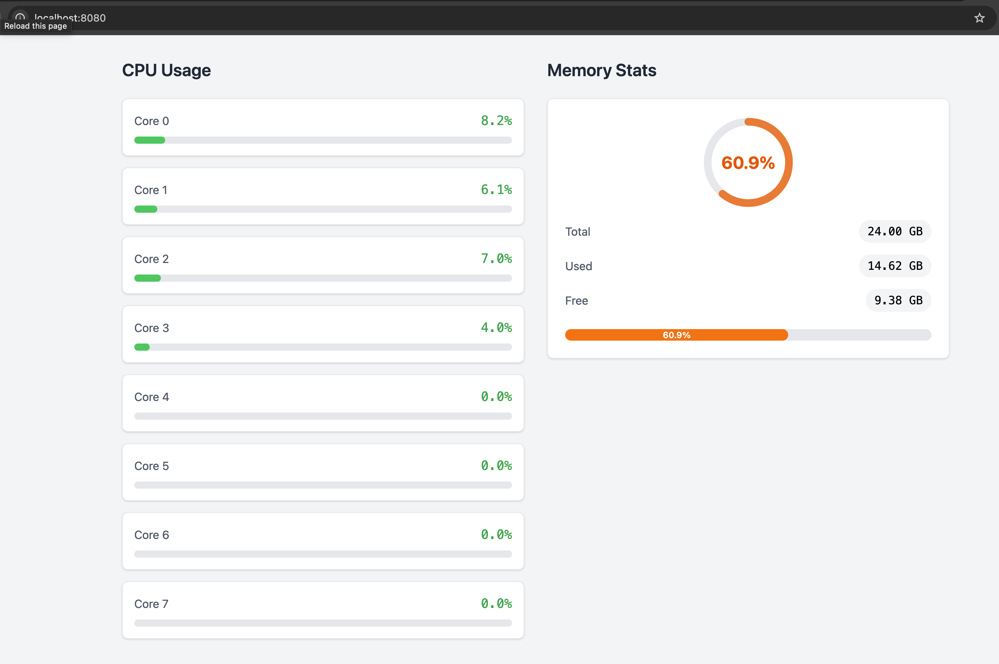

# go-mon

System resources monitor app implemented with Go+HTMX+TailwindCSS and websockets.



## Running locally

```
go run main.go
```

ought to do it, assuming you have a recent enough Go version installed.

## Local development

During development, run `./tailwindcss -i ./web/views/css/styles.css -o ./public/styles.css --watch` to keep our tailwind css file updated as we update our styling.

That is the tailwindcss standalone binary we are using (See [dev notes](./dev_notes.md) for setup instructions).

TODO improve flow, make, etc.
